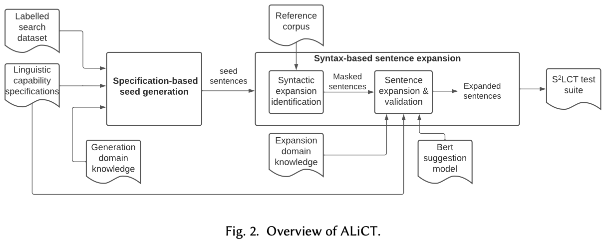

# ALiCT: Automated Linguistic Capability Test

This repository contains implementation results for the  capability testing of NLP Models as described in the following paper:

> Paper: Automated Testing Linguistic Capabilities of NLP Models

<p align="center">
    
</p>
<div align="center">
    <span style="font-size:1.5em">
        <strong>Figure 1: ALiCT Overview.</strong>
    </span>
</div>

ALiCT is an automated linguistic capability-based testing framework for NLP models. In this implementation, we generate testcases for sentiment analysis and hate speech detection. 
ALiCT generates seed test cases using [SST](https://nlp.stanford.edu/sentiment/) and [HateXplain](https://github.com/hate-alert/HateXplain) datasets as the labeled search dataset for the sentiment analysis and hate speech detection respectively.
Results of the ALiCT is [here](_results/README.md)

Table of Contents
=================

   * [ALiCT](#alict-automated-linguistic-capability-test)
      * [Table of Contents](#table-of-contents)
      * [Prerequisites](#prerequisites)
      * [Usage](#usage)
      * [Results](#results)
<!-- 
You can find more results at the project site(https://sites.google.com/view/s2lct/home). -->

Prerequisites
=================
This application is written for ```Python>3.7.11```. All requirements are listed in ```requirements.txt```, and they are installed by pip with the following command.
```bash
pip install -r requirements.txt
```

Usage
=================
## 1. Seed and expanded test case generation
This step is to generate seed and expanded test cases. 
The test cases are generated with the following command:
```bash
cd alict
# Sentiment analysis
python -m python.sa.main \
       --run template \
       --search_dataset sst \
       --search_selection random

# Hate speech detection
python -m python.hs.main \
       --run template \
       --search_dataset hatexplain \
       --search_selection random
```
Output after running the command are in the result directories of `{PROJ_DIR}/_results/templates_sa_sst_random/` and `{PROJ_DIR}/_results/templates_hs_hatexplain_random/` for sentiment analysis and hate speech detection respectively.

For each task and its result directory, the following files are generated:
```bash
cfg_expanded_inputs_{CKSUM}.json
seeds_{CKSUM}.json
exps_{CKSUM}.json
``` 
Each `{CKSUM}` is the checksum value, and it represents a linguistic capability (LC). You can see the map between the checksum value and its corresponding LC description in the `cksum_map.txt` in the result directory.

`seeds_{CKSUM}.json` and `exps_{CKSUM}.json` contain results of seed and expanded test cases respectively, and they are generated from the intermediate result, `cfg_expanded_inputs_{CKSUM}.json`. 

The `cfg_expanded_inputs_{CKSUM}.json` contains Context-Free Grammar (CFG) of the seeds and expanded production rule from the seed CFGs and words expanded from the seeds.

## 2. Testsuite generation
This step is to convert test cases in .json into .pkl files. It is because of testing models using huggingface pipelines with the format of checklist test cases. You can run it by typing the following command:
```bash
cd alict
# Sentiment analysis
python -m python.sa.main \
       --run testsuite \
       --search_dataset sst \
       --search_selection random

# Hate speech detection
python -m python.hs.main \
       --run testsuite \
       --search_dataset hatexplain \
       --search_selection random
```
Output testsuite files in the result directories (the result directories of `{PROJ_DIR}/_results/test_results_sa_sst_random/` and `{PROJ_DIR}/_results/test_results_hs_hatexplain_random/` for sentiment analysis and hate speech detection respectively) are the following:

```bash
# Sentiment analysis
{PROJ_DIR}/_results/test_results_sa_sst_random/sa_testsuite_seeds_{CKSUM}.pkl
{PROJ_DIR}/_results/test_results_sa_sst_random/sa_testsuite_exps_{CKSUM}.pkl

# Hate speech detection
{PROJ_DIR}/_results/test_results_hs_hatexplain_random/hs_testsuite_seeds_{CKSUM}.pkl
{PROJ_DIR}/_results/test_results_hs_hatexplain_random/hs_testsuite_exps_{CKSUM}.pkl
```

## 3. Run model on the generated testsuites
This step is to run the model on our generated test cases. You can run it by the following command:
```bash
cd alict
# Sentiment analysis
python -m python.sa.main \
       --run testmodel \
       --search_dataset sst \
       --search_selection random

# Hate speech detection
python -m python.hs.main \
       --run testmodel \
       --search_dataset hatexplain \
       --search_selection random
```
Then, the test result files are
```bash
# Sentiment analysis
{PROJ_DIR}/_results/test_results_sa_sst_random/test_results.txt

# Hate speech detection
{PROJ_DIR}/_results/test_results_hs_hatexplain_random/test_results.txt
```

## 4. Analyze the testing results
This step is to analyze the reults from Step 3 and get the test results. You can run it by the following command:
```bash
cd s2lct
# Sentiment analysis
python -m python.sa.main \
       --run analyze \
       --search_dataset sst \
       --search_selection random

# Hate speech detection
python -m python.hs.main \
       --run analyze \
       --search_dataset hatexplain \
       --search_selection random
```

Output results are
```bash
# Sentiment analysis
{PROJ_DIR}/_results/test_results_sa_sst_random/test_result_analysis.json

# Hate speech detection
{PROJ_DIR}/_results/test_results_hs_hatexplain_random/test_result_analysis.json
```
The output results are ``` The file is parsed version of ``` test_results.txt obtained from [step 3](#3-run-model-on-the-generated-testsuites).


Results
=================

See the documentation [here](_results/README.md)
