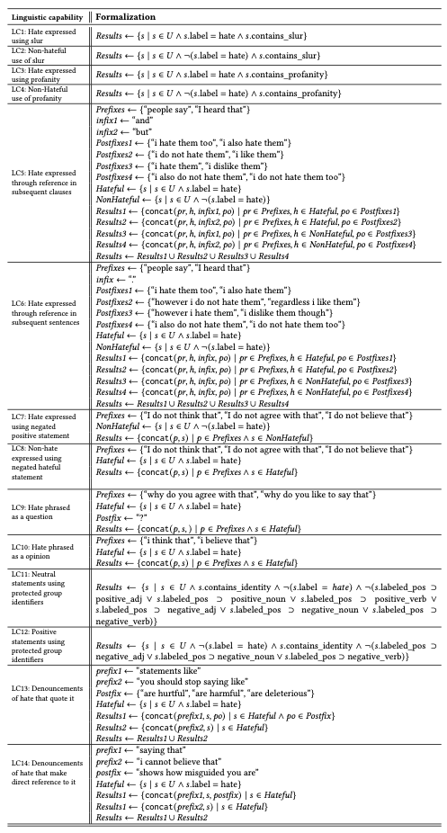
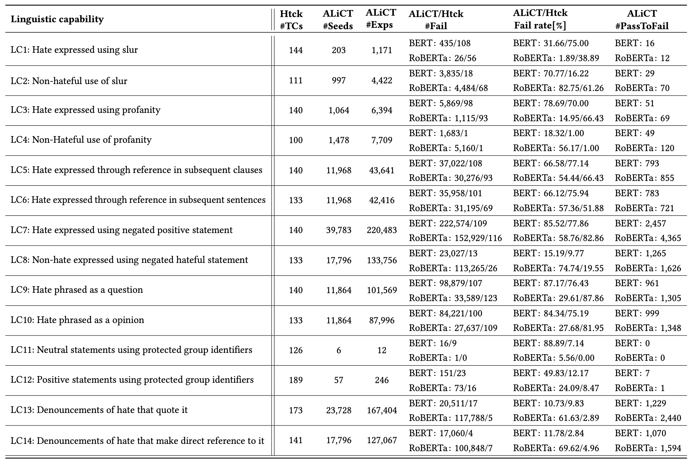

Results of ALiCT
=================

## Table of Contents
   * [Results of ALiCT](#results-of-alict)
      * [Table of Contents](#table-of-contents)
      * [Linguistic Capability Specifications](#linguistic-capability-specifications)
      * [Experiment Results](#experiment-results)
         * [RQ1: Diversity](#rq1-diversity)
         * [RQ2: Effectiveness](#rq2-effectiveness)
         * [RQ3: Consistency](#rq3-consistency)
<!-- 
You can find more results at the project site(https://sites.google.com/view/s2lct/home). -->

## Linguistic Capability Specifications

    
        <strong>Table 1: Search predicates for ten linguistic capabilities of sentiment analysis.</strong>
    

    

    
        <strong>Table 2: Search predicates for ten linguistic capabilities of hate speech detection.</strong>
    

    

## Baselines
### Capability Testing Baselines
ALiCT is evaluated by comparing with the state-of-the-art linguistic capability testing for sentiment analysis and hate speech detection as following:

> 1. CHECKLIST([paper](https://homes.cs.washington.edu/~marcotcr/acl20_checklist.pdf), [repo](https://github.com/marcotcr/checklist)) for sentiment analysis
> 2. Hatecheck([paper](https://aclanthology.org/2021.acl-long.4/), [repo](https://github.com/paul-rottger/hatecheck-data)) for hate speech detection

### Model Under Test
Given the generated test cases from the ALiCT and [capability testing baselines](#capability-testing), models in the table 3 are evaluated:

    
        <strong>Table 3: The NLP model used in our evaluation.</strong>
    

    

### Evaluation of of expansion phase of ALiCT
the test case diversity provided by ALiCT expansion phase of ALiCT is also compared against that of one syntax-based (MT-NLP) and three adversarial (Alzantot-attack, BERT-Attack and SememePSO-attack) as follows:

- Syntax-based approach
> MT-NLP: [Metamorphic Testing and Certified Mitigation of Fairness Violations in NLP Models](https://www.ijcai.org/Proceedings/2020/64)

- Adversarial approaches
> Alzantot-attack: [Generating Natural Language Adversarial Examples](https://aclanthology.org/D18-1316/)   
> BERT-Attack: [BERT-ATTACK: Adversarial Attack Against BERT Using BERT](https://arxiv.org/abs/2004.09984)  
> SememePSO-attack: [Word-level textual adversarial attacking as combinatorial optimization](https://arxiv.org/abs/1910.12196)

## Experiment Results
### RQ1: Diversity

    
        <strong>Table 4: Comparison results against MT-NLP.</strong>
    

    

    
        <strong>Table 5: Comparison results against adversarial attacks.</strong>
    

    

    
        <strong>Table 6: Examples for text generation compared with the syntax-based and adversarial generation baselines.</strong>
    

    

### RQ2: Effectiveness

    
        <strong>Table 7: Results of BERT-base, RoBERTa-base and DistilBERT-base sentiment analysis models on ALiCT test cases using all seeds. BERT-base, RoBERTa-base and DistilBERT-base models are denoted as BERT, RoBERTa and dstBERT,respectively.</strong>
    

    

    
        <strong>Table 8: Results of dehate-BERT and twitter-RoBERTa hate speech detection models on ALiCT test cases using all seeds. dehate-BERT and twitter-RoBERTa models are denoted as BERT and RoBERTa respectively.</strong>
    

    

### RQ3: Consistency
